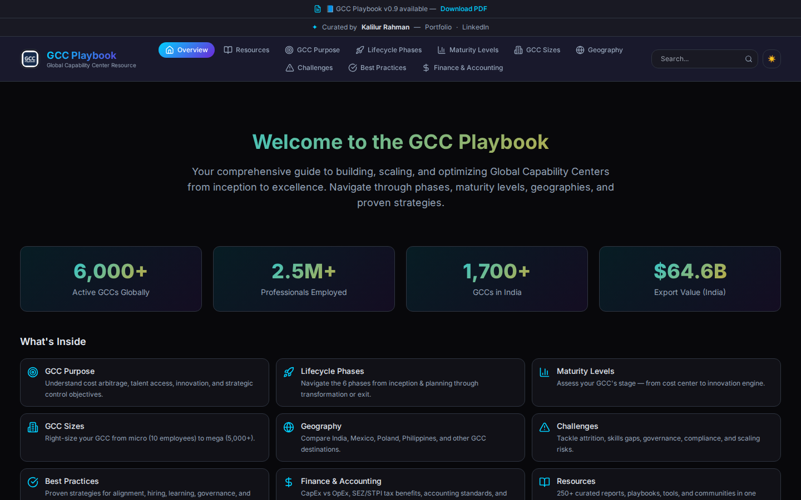
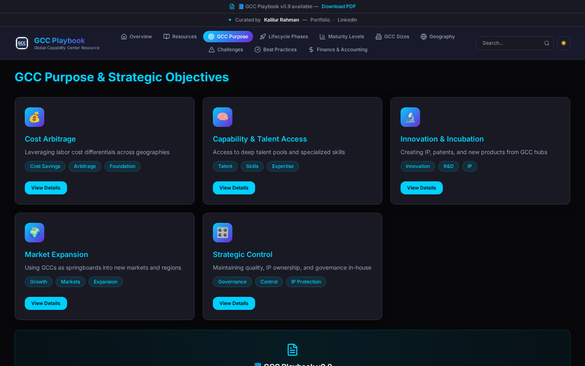
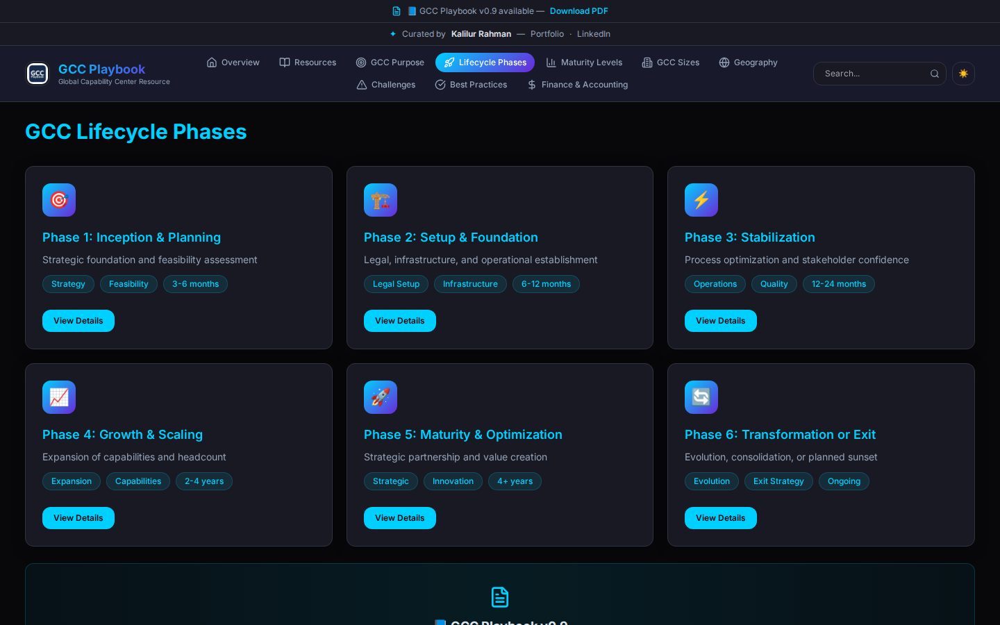
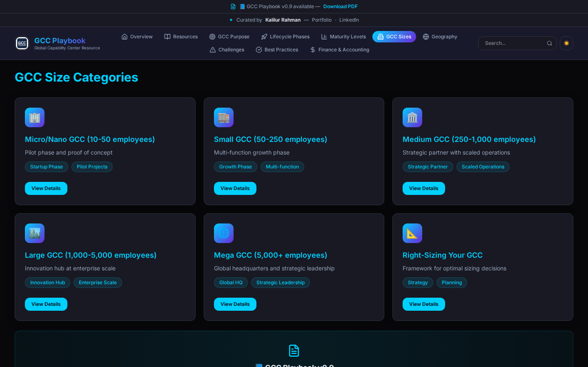
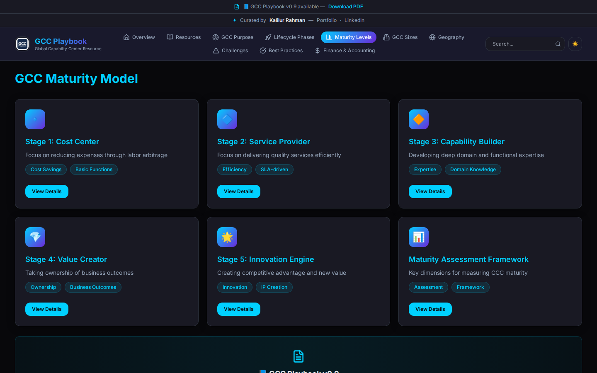
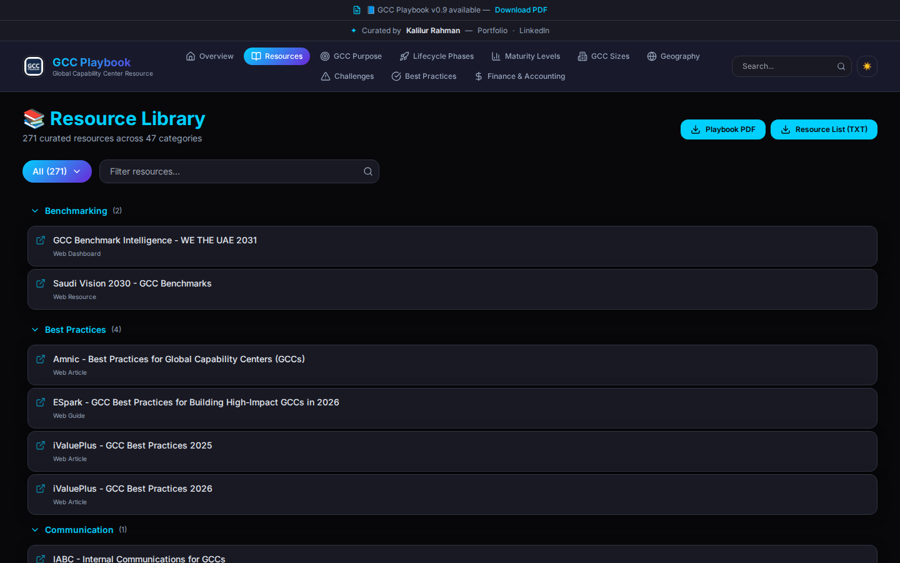

# GCC Playbook

**Live URL**: [https://gcc-playbook-hub.lovable.app](https://gcc-playbook-hub.lovable.app)

Welcome to the **GCC Playbook**, a comprehensive guide to building, scaling, and optimizing Global Capability Centers from inception to excellence.

This interactive web application provides an intuitive way to explore phases, maturity levels, geographies, best practices, and proven strategies for GCC professionals globally.

## The Dashboard

The GCC Playbook offers a centralized dashboard that tracks key metrics like active GCCs globally, professionals employed, and export values, serving as your ultimate launchpad.

### Dark & Light Modes

The application supports both themes for an accessible and customizable reading experience. Navigate seamlessly between modes!


*Main Dashboard in Light Mode*


*Main Dashboard in Dark Mode*

---

## Core Topics & Deep Dives

The GCC Playbook is categorized into several highly curated topics. You can explore each directly from the dashboard or the header navigation.

### 🎯 GCC Purpose & Strategic Objectives
Explore the foundational drivers for GCCs, moving from traditional cost arbitrage to advanced capability building and becoming core innovation engines.



### 🚀 Lifecycle Phases
A step-by-step interactive timeline spanning inception, setup, stabilization, growth, optimization, and potential exit strategies.



### 🏢 GCC Sizes & Scaling
A thorough breakdown of GCCs by size category, helping organizations optimize and right-size their operations based on functions and growth targets.



### 📊 Maturity Levels
Understand the 5 stages of capability center growth, from a simple cost center to a global value creator. Toggle views in dark or light mode based on your preference.



---

## 📚 Resource Library (/library)

A meticulously curated library of consulting reports, government portals, legal advisors, technology platforms, and open-source intelligence tools tailored for GCC operations.

Our new Resource Library features dynamic filtering, categorization, and responsive design tailored for extensive research.


*Resource Library Overview*

### Interactive Filtering & Dropdowns
Easily browse through dozens of categories using our interactive dropdown menu, allowing you to quickly drill down into the topics that matter most.


*Interactive Category Dropdown*

### Live Search
Know exactly what you're looking for? Use the live search to filter resources by title, category, or type in real-time.


*Live Search & Filtering*

### Fully Supported Theme Switching
Whether exploring the library or reviewing strategies, you can transition between light and dark modes instantly.


*Library Dashboard (Light Mode)*


*Library Filtering (Light Mode)*

All screenshots and UI examples have been freshly generated to reflect the latest state of the GCC Playbook Hub, specifically highlighting our robust and interactive Resource Library.

---

### Additional Sections Explored:
- **Geography Guide**: In-depth comparative analysis of major GCC hubs worldwide, including India, Mexico, Colombia, Poland, and more.
- **Challenges & Solutions**: Common operational pitfalls (talent attrition, compliance risks, rapid scaling) and actionable mitigation strategies.
- **Best Practices**: Proven frameworks for governance, product ownership, and continuous enterprise learning.
- **Finance & Accounting**: CapEx vs. OpEx models, localized tax insights (SEZ/STPI), and implementation differences between GAAP and IFRS.

---

## Technologies Under the Hood

This project is built using modern web development standards to ensure a fast, robust, and scalable user experience:

- **React 18** & **Vite**: For lightning-fast module replacement and efficient builds.
- **TypeScript**: Ensuring type safety and scalable code structures.
- **Tailwind CSS**: Utility-first CSS framework for rapid and responsive styling.
- **shadcn-ui**: A beautifully designed, highly customizable, and accessible component library.
- **Framer Motion**: Delivering smooth, hardware-accelerated page transitions and animations.
- **Lucide React**: Crisp, modern vector icons.

## Repository & Folder Structure

The source code has been modularly structured for clarity and long-term maintenance:

- **`src/`**: Main source code directory ([Read more](src/README.md)).
- **`src/components/`**: Reusable UI components & layouts ([Read more](src/components/README.md)).
- **`src/data/`**: The static TypeScript definitions driving the playbook's content ([Read more](src/data/README.md)).
- **`src/pages/`**: Top-level route components acting as main views ([Read more](src/pages/README.md)).
- **`public/`**: Static assets, including the images showcased above.

---

## Local Development Setup

To explore or modify the GCC Playbook locally, follow these steps:

1. **Clone the repository:**
   ```sh
   git clone <YOUR_GIT_URL>
   cd <YOUR_PROJECT_NAME>
   ```

2. **Install dependencies:**
   Make sure you have Node.js and npm installed.
   ```sh
   npm install
   ```

3. **Start the development server:**
   ```sh
   npm run dev
   ```

4. Open `http://localhost:5173/` (or the port specified by Vite) in your browser.

## Contributing

- **Direct GitHub Edits:** Click the "Edit" button (pencil icon) on any file view and commit your changes directly.
- **Use Lovable:** Visit the [Lovable Project Dashboard](https://lovable.dev) and prompt your changes via AI. Code will be committed and synchronized automatically.

## License

Created and curated for GCC Professionals Worldwide by **Kalilur Rahman**.