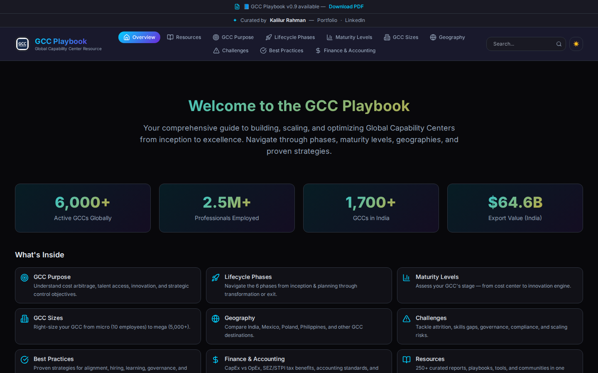
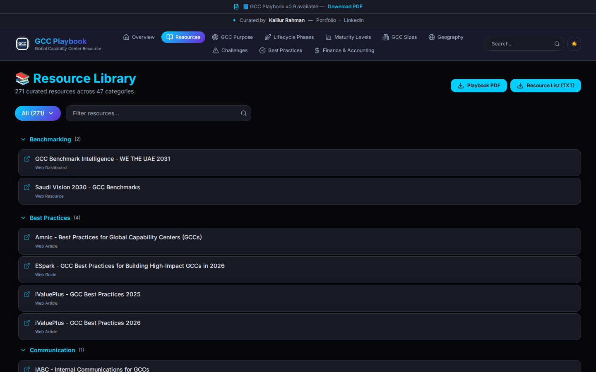

# `src/` - Source Code Directory

This directory contains the main source code for the GCC Playbook application. It is structured into logical folders to maintain a clear separation of concerns.

## Directory Structure

- **`components/`**: Contains reusable and modular React components that construct the user interface. Components such as `GCCHeader`, `GCCFooter`, `ContentSection`, and `ResourcesExplorer` reside here. ([More details](components/README.md))
- **`data/`**: Centralized storage for the static JSON/TypeScript objects representing the content of the GCC Playbook (e.g., `gccData.ts`). ([More details](data/README.md))
- **`hooks/`**: Custom React hooks for encapsulating shared behavior.
- **`lib/`**: General library utilities and shared functions (e.g., the `utils.ts` for handling Tailwind class merging via `clsx` and `tailwind-merge`).
- **`pages/`**: The top-level React components representing the views of the application, used in routing. ([More details](pages/README.md))

*Resource Library View*

## Key Files

- **`App.tsx`**: The main entry point of the React application where routing and global context providers (QueryClientProvider, TooltipProvider, Toasters) are defined.
- **`main.tsx`**: Renders the React root element to the DOM.
- **`App.css` & `index.css`**: Global stylesheet definitions and Tailwind directives.

## Best Practices

- When creating new features, determine whether the code belongs in a new component, a new page, or should be added to existing components.
- Keep the `data/` directory strictly for static definitions.
- Write tests alongside new additions in the `test/` directory.