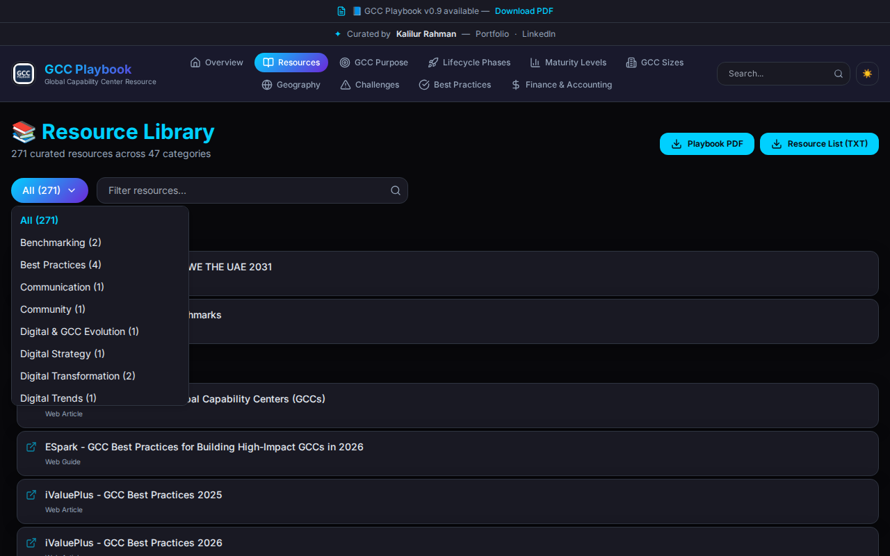
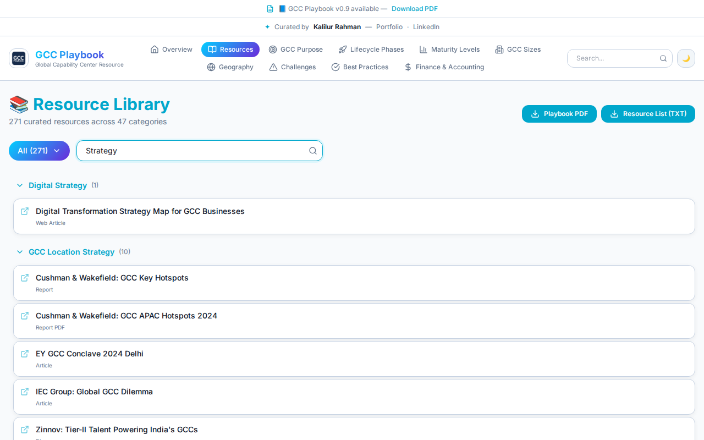
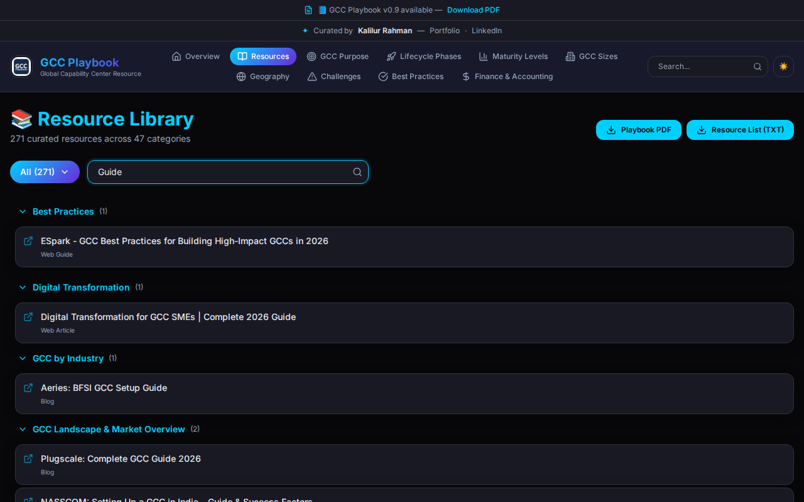

# Components

The `src/components/` directory contains all reusable UI components and specialized layout structures used across the GCC Playbook. The architecture embraces composition, modularity, and atomic design principles utilizing `shadcn-ui`, `framer-motion`, and `lucide-react`.

## Core Structural Components

- **`GCCHeader.tsx`**: The main application navigation bar. It includes responsive mobile menus, live search functionality, and a theme toggler. It controls the `activeSection` state across the Single Page Application (SPA).
- **`GCCFooter.tsx`**: A responsive footer providing additional contextual links, copyright details, and social channels.
- **`OverviewSection.tsx`**: The primary dashboard landing component tracking high-level metrics (e.g., globally active GCCs, total professionals employed).
- **`ContentSection.tsx`**: A wrapper component to present individual topics like Geography, Best Practices, and Challenges in an aesthetically consistent card layout.

## Data Display Components

- **`GCCCard.tsx`**: A flexible card component used extensively throughout the application to render specific phases, lifecycle steps, and maturity levels dynamically.

---

## 📚 ResourcesExplorer.tsx (The Library)

The `ResourcesExplorer` is a highly interactive component responsible for rendering the GCC Playbook's curated resource library. Rather than being a separate page, it serves as a massive functional module with built-in search, filtering, grouping, and direct document downloads.

### Key Capabilities

1. **Category Grouping & Expansion:** Resources are logically mapped to categories. Users can collapse or expand specific groups to refine their reading view.
2. **Interactive Dropdown Filter:** Users can filter the entire library down to a specific category.

*Filtering the Library by Category*

3. **Live Search Integration:** Allows real-time string matching against resource names, categories, and types.

*Searching for "Strategy" within the Light Theme*

*Searching for "Guide" within the Dark Theme*

4. **Contextual Document Handling:** Recognizes direct PDF links and appends download behaviors while gracefully opening external resources in isolated tabs.

---

## Additional Information

All components heavily rely on the static data stores housed within the `src/data/` directory to remain completely stateless whenever possible, offloading state management strictly to the main index/parent levels or specifically within complex interactives like the `ResourcesExplorer`.