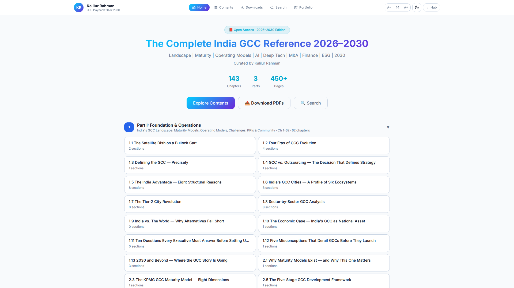
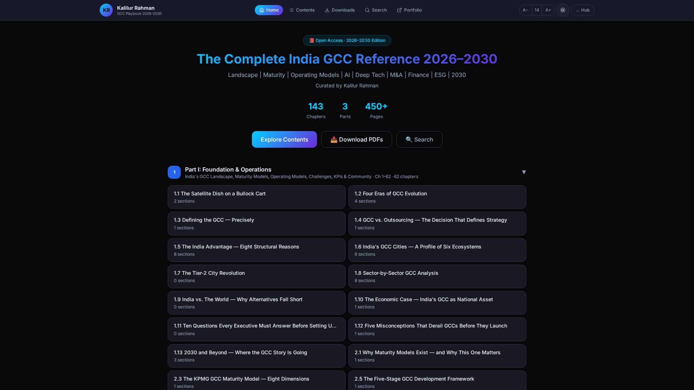

# Playbook Components

This directory (`src/components/playbook/`) contains the core React components responsible for rendering the **Playbook Viewer** (`/playbook`), the primary reading and learning interface of the GCC Playbook Hub application.

## Overview

The Playbook Viewer is designed to offer a distraction-free, highly interactive, and customizable reading experience. It consists of multiple modular components working together to handle navigation, progress tracking, content rendering, and user preferences (like theme and font size).

## Key Components

- **`PlaybookHeader.tsx`**: The top navigation bar specific to the playbook. It includes:
  - Navigation links to key areas (Home, Index, Resources).
  - Font size controls (`A-` / `A+`).
  - Theme toggler (☀️/🌙).
  - A responsive mobile drawer (hamburger menu) built with `shadcn-ui`'s `Sheet` component, allowing access to the master index and quick actions on smaller screens.
- **`PlaybookSidebar.tsx`**: A desktop-optimized collapsible sidebar that displays:
  - The **Master Index** (Parts and Chapters) using accordion menus.
  - Overall progress tracking.
  - Quick navigation links.
- **`PlaybookContent.tsx`**: The main reading area. It handles:
  - Rendering markdown or rich text content for each chapter.
  - Displaying chapter metadata (estimated reading time, author, date).
  - Highlighting terms and displaying glossary tooltips.
  - Managing reading progress and scroll position.
- **`PlaybookFooter.tsx`**: Provides sequential navigation (Previous/Next Chapter) and quick links at the bottom of the reading view.

## Features & Interactions

### Theming
All components are built to fully support both Light and Dark modes. The theme toggle in the header immediately updates the UI without requiring a page reload.


*Playbook Viewer in Dark Mode, showing the sidebar and content area.*


*Playbook Viewer in Light Mode, optimized for readability.*

### Responsive Design
The layout gracefully degrades from a full desktop experience with a persistent sidebar to a mobile-friendly view where navigation is tucked away in a slide-out drawer (`PlaybookHeader`'s mobile menu).

### Typography Customization
Users can adjust the font size directly from the header. This state is managed centrally (likely via a context or higher-level state in `PlaybookViewer.tsx`) and passed down to ensure text scales consistently across the reading area.

## Usage

These components are primarily composed within the main page route: `src/pages/PlaybookViewer.tsx`. They rely on static data structures defined in `src/data/playbookData.ts` (or similar) to render the master index and chapter content.

```tsx
// Example simplified structure of how they might be used
import { PlaybookHeader, PlaybookSidebar, PlaybookContent } from "@/components/playbook";

export default function PlaybookViewer() {
  return (
    <div className="flex flex-col min-h-screen">
      <PlaybookHeader />
      <div className="flex flex-1 overflow-hidden">
        <PlaybookSidebar />
        <main className="flex-1 overflow-y-auto">
          <PlaybookContent />
        </main>
      </div>
    </div>
  );
}
```

## Contributing

When modifying or adding components here:
1. Ensure they remain highly accessible (use ARIA labels, semantic HTML).
2. Maintain support for both light and dark themes using Tailwind's `dark:` classes or CSS variables.
3. Test responsiveness across different device sizes, particularly focusing on the interaction between the sidebar and mobile drawer.